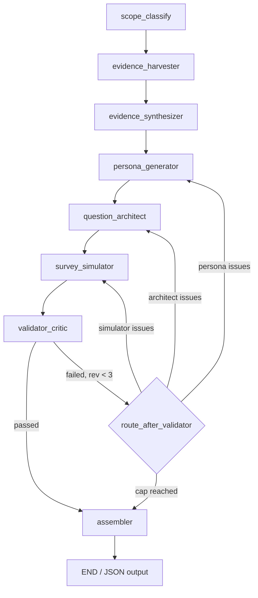

# Survey Agent — Architecture & Engineering Guide

This document explains how the **Survey Agent** works end to end: what problem it solves, how data flows through the pipeline, and the engineering decisions behind each component.

---

## Table of Contents

1. [Purpose & Design Philosophy](#1-purpose--design-philosophy)
2. [High-Level Architecture](#2-high-level-architecture)
3. [Pipeline Overview (8 Nodes)](#3-pipeline-overview-8-nodes)
4. [Shared State (`SurveyState`)](#4-shared-state-surveystate)
5. [Node-by-Node Deep Dive](#5-node-by-node-deep-dive)
6. [Evidence Layer](#6-evidence-layer)
7. [Persona Simulation Model](#7-persona-simulation-model)
8. [Questionnaire Design](#8-questionnaire-design)
9. [Answer Simulation & Regional Variants](#9-answer-simulation--regional-variants)
10. [Validation & Revision Loop](#10-validation--revision-loop)
11. [Output Assembly & Frontend Contract](#11-output-assembly--frontend-contract)
12. [LLM Strategy](#12-llm-strategy)
13. [Caching Strategy](#13-caching-strategy)
14. [Configuration & Dependencies](#14-configuration--dependencies)
15. [Running the Agent](#15-running-the-agent)
16. [Key Engineering Decisions (Summary)](#16-key-engineering-decisions-summary)

---

## 1. Purpose & Design Philosophy

### What it does

Given a **market segment** (e.g. `"global washing machine market"`), the agent produces:

- A **consulting-grade** questionnaire: **~5–10 questions per tab** (default **8** → ~**32** total) across **4 fixed tabs**
- **`targetCustomer`** at the top of the JSON — who the instrument interviews
- **Synthetic answer-percentage distributions** (2 decimals; sum-to-100 where required)
- **Per-question display `N`** in **300–500** (multiples of 10); rich `sample_size` stays **2500**
- **Regional variants** (5 continents + A6 global blend) and a **frontend-ready JSON** for the CMI platform UI

### Core design principle: persona simulation, not report pasting

The agent does **not** copy percentages from market reports onto survey options. Instead:

| Layer | Role |
| --- | --- |
| **Reports / stats / web** | Shape the **Market Knowledge Profile (MKP)** — structural bands (maturity, price sensitivity, growth) |
| **Reddit / reviews** | Shape **consumer language** — pain points, complaint wording, option labels |
| **Personas** | Define **who** the synthetic panel is |
| **Survey Simulator** | Reasons over persona weights + MKP to produce **plausible distributions** |

This avoids the common failure mode of laundering B2B market-sizing figures into B2C consumer survey answers.

### B2C-first with B2B awareness

The deliverable is always a **B2C consumer survey**, but the CMI database corpus is largely **B2B / industrial market-sizing**. Node 1 (`scope_classify`) detects this mismatch early:

- **B2C segments** → expect stronger consumer grounding
- **B2B segments** → define a **consumer-proxy audience** (e.g. patients for a medical treatment, small-business buyers for industrial equipment) and record that grounding will be limited

---

## 2. High-Level Architecture

### Technology stack

| Component | Choice | Rationale |
| --- | --- | --- |
| Orchestration | **LangGraph** (`StateGraph`) | Explicit node graph, conditional revision routing, async streaming |
| State | **TypedDict** with reducers | Type-safe shared state; `evidence_pool` uses `operator.add` for accumulation |
| LLM | **DeepSeek** (default), OpenRouter, Anthropic | Cost-effective structured JSON; provider-agnostic factory |
| Database | **Neon Postgres** (psycopg2) | CMI report corpus |
| Web search | **Exa** + **Reddit** (rdt-cli) + **DuckDuckGo** | Angle-based routing; graceful degradation |
| Page fetch | **Jina Reader** (`r.jina.ai`) | Clean markdown without API key; requests+BS fallback |
| Validation | **Pydantic v2** models | Structured LLM I/O + schema enforcement |

### Pipeline diagram



### Entry point

`run.py` is the **segment-only CLI** (no Docker required):

1. Classifies B2C once (`scope_classify`)
2. Fans out the fixed **5 geographic regions** sequentially (`run_one_region_async`)
3. Runs **A6 global selection** (`run_global_selection`)
4. Writes `output/<slug>_<region>.json` + `global.json` and publishes under
   `cmi-platform-ai/frontend-v2/.../public/surveys/<slug>/`

RQ alternative: `enqueue.py` + Docker workers (`classify_and_fanout` → 5 region
jobs + fan-in). Host Redis URL is typically `redis://localhost:6380`.

---

## 3. Pipeline Overview (8 Nodes)

| # | Node | External I/O | Produces |
| --- | --- | --- | --- |
| 1 | `scope_classify` | LLM only | Normalized segment, B2C/B2B, audience profile, regions to simulate |
| 2 | `evidence_harvester` | CMI DB + web (parallel) | `evidence_pool` (unified facts) |
| 3 | `evidence_synthesizer` | LLM | `market_knowledge_profile` (MKP) |
| 4 | `persona_generator` | LLM | `persona_catalog` (10–16 archetypes + regional weights) |
| 5 | `question_architect` | LLM (parallel per tab) | Instrument (~8×4 default; env 5–10/tab) |
| 6 | `survey_simulator` | LLM (async batches) | `answered_questions` with distributions |
| 7 | `validator_critic` | Code + LLM judge | `critique`, `grounded_pct`, pass/fail |
| 8 | `assembler` | None (pure code) | `final_survey` with `targetCustomer` + frontend |

**Legacy nodes** (`evidence_indexer`, `answer_estimator`) exist in the codebase but are **not wired into the current graph**. The persona-simulation path replaced direct evidence-to-percentage mapping.

---

## 4. Shared State (`SurveyState`)

Defined in `src/state.py` as a `TypedDict`. LangGraph merges partial dicts returned by each node.

### Key fields by stage

```
market_segment, normalized_segment, segment_type, region, regions_to_simulate
    → audience_profile, classification_reason

evidence_pool (Annotated[List[dict], operator.add])
    → evidence_empty

market_knowledge_profile, grounding_thin

persona_catalog

questions, counts_by_tab, questionnaire_id, questionnaire_cache_hit

answered_questions, answered_by_region
    → grounded_question_count, simulation_confidence_avg

critique, grounded_pct, revision_count

final_survey
```

### Engineering note: `evidence_pool` reducer

`evidence_pool` uses `operator.add` so parallel harvest branches (if added later) accumulate facts rather than overwrite. Today harvesting is a single async node, but the reducer future-proofs fan-out.

### Engineering note: region-invariant questionnaire

The **question text and options are identical across regions**. Only **answer distributions** differ per region (via persona weight packs in the simulator). This mirrors real survey practice: same instrument, different population mixes.

---

## 5. Node-by-Node Deep Dive

### Node 1 — `scope_classify`

**File:** `src/nodes/scope_classify.py`

**Purpose:** Pure framing. No DB, no web — only the LLM and its general knowledge.

**Inputs:** `market_segment`, optional `region` (default `"Global"`)

**Outputs:**
- `normalized_segment` — canonical name (e.g. `"Organic Milk"`)
- `segment_type` — `"b2c"` or `"b2b"`
- `classification_reason` — plain-language justification
- `audience_profile` — demographics, behaviors, qualifiers, exclusions, assumptions
- `regions_to_simulate` — simulation universe

**Region logic:**
- If scope is **Global** → simulate all 6 regions (`Global` + 5 continents)
- If scope is a specific continent → `["Global", <matched continent>]`
- Unknown region → fall back to full set

**Engineering decision:** Detect B2B-natured segments upfront so downstream nodes know grounding will be thin and can define consumer-proxy audiences explicitly in `assumptions`.

---

### Node 2 — `evidence_harvester`

**File:** `src/nodes/evidence_harvester.py`

**Purpose:** Gather as much citable evidence (especially numbers) as possible into a unified `evidence_pool`.

**Two sources run concurrently** via `asyncio.gather(..., return_exceptions=True)`:

#### Source A — CMI Database (Neon Postgres)

1. `find_reports(segment)` — token-match against `newsSubject`, `keyword`, `keywords`, `segmentation`
2. Prioritize reports that have enrichment data (`reports_with_data`)
3. Mine up to **8 reports** from top **25** candidates
4. Extract facts from:
   - `cmi_reportsummery` — section columns + insight header/description pairs
   - `cmi_report_dynamic` — `field_N` / `disc_N` pairs (up to 20)

**Token matching engineering:**
- Stopwords stripped (`"global"`, `"market"`, etc.)
- Plural stemming (`sneakers` → `sneaker`)
- Synonym expansion (`sneakers` → `footwear`, `athletic`, `shoe`)

#### Source B — Web (`web_search.search_web`)

Six consumer-focused queries with **angle tags** for source routing:

| Query goal | Angle |
| --- | --- |
| Consumer survey statistics | `trends` |
| Purchase frequency & preferences | `needs` |
| Market share regional breakdown | `market_share` |
| Consumer demographics | `trends` |
| Price & willingness to pay | `pricing` |
| Customer complaints / reviews | `complaints` |

**Resilience:** Either source failing returns `[]` for that side; the node never crashes the pipeline.

**Post-processing:** `dedupe_facts()` → `cap_facts()` (default ceiling **120**, numeric facts prioritized).

**Unified fact shape** (from `evidence_utils.py`):

```json
{
  "fact": "string",
  "value": "41%" | null,
  "is_numeric": true,
  "topic": "regional share",
  "tab_hint": "consumer_profile",
  "origin": "cmi_database" | "exa" | "reddit" | "stat" | "web",
  "authority": "high" | "medium" | "low",
  "source_ref": "report:1234" | "https://...",
  "title": "Report title — section",
  "retrieved_at": "ISO-8601"
}
```

---

### Node 3 — `evidence_synthesizer`

**File:** `src/nodes/evidence_synthesizer.py`

**Purpose:** Compress raw facts into a **Market Knowledge Profile (MKP)** — the structured market model for personas and simulation.

**Hard rules enforced in prompts and code:**

| Evidence type | May influence |
| --- | --- |
| CMI DB, stats, Exa, web | Structural bands: maturity, income, price sensitivity, growth, tech adoption, eco awareness, brand loyalty, sentiment |
| Reddit, complaints, reviews | `top_pain_points`, `consumer_language`, `feature_requests` only |
| Any source | `regional_notes` (qualitative, no percentages) |

**Does NOT emit answer percentages.**

**MKP fields** (see `MarketKnowledgeProfile` in `models.py`):
- Structural enums: `market_maturity`, `growth_outlook`, `technology_adoption`, `consumer_sentiment`
- Band levels: `avg_income_band`, `price_sensitivity`, `environmental_awareness`, `brand_loyalty`
- Lists: `top_pain_points`, `top_purchase_drivers`, `competitor_weaknesses`, `government_incentives`, `consumer_language`, `feature_requests`
- Meta: `regional_notes`, `evidence_confidence`, `citations`, `synthesis_notes`

**Fallback:** If evidence is empty or LLM fails → `_fallback_mkp()` with `evidence_confidence: "low"` and `grounding_thin: true`.

**Caching:** MKP cached by segment + evidence digest (see [Caching](#13-caching-strategy)).

---

### Node 4 — `persona_generator`

**File:** `src/nodes/persona_generator.py`

**Purpose:** Create **10–16 weighted consumer archetypes** and **per-region population weight packs** (each sums to ~100%).

**Two-phase LLM generation:**

1. **Archetype batch** — 12 distinct personas with demographics, motivations, pains, goals, behaviors
2. **Per-region weight packs** — one LLM call per region in `regions_to_simulate`

**Weight normalization (`_normalize_weights`):**
- Clamp negatives, re-scale to 100%
- Absorb floating-point drift into the largest persona

**Global blend:** If `"Global"` not explicitly generated, compute mean of regional packs.

**Fallback personas:** 12 generic templates (Young Professional, Budget Family, Eco Conscious, etc.) if LLM fails or returns fewer than 10.

**Engineering decision:** Personas absorb Reddit/MKP language into `pain_points` so the simulator and question architect can use real consumer wording without treating Reddit as a numeric source.

---

### Node 5 — `question_architect`

**File:** `src/nodes/question_architect.py`

**Purpose:** Generate a **consulting-grade questionnaire** — default **8 questions
per tab** (~**32** total), band **5–10** via env (`question_plan.py`).

Schema cache version: `questionnaire_v8`.

#### The 4 tabs (`question_plan.py`)

| Tab key | Content focus | Default count |
| --- | --- | --- |
| `consumer_profile` | Usage context, occasions, frequency, need-state — **not** age/income/residence | 8 |
| `buying_behavior` | Channels, triggers, category spend, journey — **not** brand/company names | 8 |
| `preferences_expectations` | Attributes, formats, claims, trade-offs — no named competitors | 8 |
| `satisfaction_future_intent` | Satisfaction, friction, switching, recommend / future use | 8 |

With `REGION_QUESTION_MODE=core_plus_module`: ~**6 CORE** + ~**2 MODULE** per tab.

#### Generation mode

`GENERATION_MODE = "quota"` — fill to TARGET per tab even when evidence is thin
(simulator will infer percentages). Alternative `"honest"` mode exists but is
not the default.

#### Chunked generation (BUG 5 fix)

DeepSeek has an ~8k output token cap. Each tab is generated in chunks of
**8 questions** (`QUESTION_CHUNK`), looping until quota is met (up to
`MAX_TAB_ATTEMPTS = 6`). Prior questions are fed back as "do not duplicate"
context; gen-time drop uses **loose** Jaccard similarity.

#### Parallel tab generation

`ThreadPoolExecutor` runs all 4 tabs concurrently.

#### Hard rules in prompts + code

1. **Subject rule** — every question must be about the exact target segment
2. **No geo-residence** — region is a UI filter (regex + validator)
3. **No age / income** — demographics live in `targetCustomer`, not the instrument
4. **No brand / company names** — no “which brand…” stems; no manufacturer option lists
5. **Hard uniqueness** — similar constructs / paraphrases are forbidden
6. **No broken matrix grids** — never “each of the following” + scale-only options; one Likert per factor
7. **Closed options only** — no open-ended
8. **Options from evidence** — lift real complaint language; `options_from_evidence` independent of answer grounding
9. **Chart/type separation** — `type` = answer format; `chart_type` = visualization

#### Question types

| `type` | Sum to 100%? | Chart typical |
| --- | --- | --- |
| `single_choice` | Yes | `bar`, `donut` |
| `multiple_choice` | No (independent rates) | `horizontal_bar` |
| `ranking` | Yes | `bar` |
| `likert_5`, `likert_7` | Yes | `bar`, `horizontal_bar` |

#### Revision behavior

On validator failure routed to architect:
- Drop flagged question IDs (including age/income/brand/hygiene/dup)
- Drop geo-residence / banned demographic / brand screeners always
- Regenerate only the shortfall per tab
- Skip cache on revision

#### Caching

Full questionnaire cached per segment + MKP pain points + persona IDs. Cache hit
requires ≥`QUESTIONNAIRE_CACHE_MIN_QUESTIONS` (= MIN×4).
---

### Node 6 — `survey_simulator`

**File:** `src/nodes/survey_simulator.py`

**Purpose:** Simulate how a **weighted persona panel of N=2500** would answer the universal questionnaire.

**This node replaced `answer_estimator`** in the current architecture.

#### Simulation model

For each region:
1. Load persona cards with `weight_pct` from `weights_by_region`
2. Pass MKP digest + regional note to LLM
3. LLM outputs per-question distributions with `distribution_note` and `confidence`

**Hard rules in prompt:**
- Do NOT paste market-report statistics onto options
- Do NOT cite Reddit as numeric source
- `single_choice` / `likert_*` / `ranking` must sum to 100 (±1)
- `multiple_choice` — independent 0–100 rates, NOT summed to 100

#### Batching

- `BATCH_SIZE = 8` questions per LLM call
- Regions simulated in parallel via `asyncio.gather`
- Global is always in the simulation set; `answered_questions` uses Global as primary

#### Post-processing (`_enforce_sums`)

- Round to **2 decimal** places
- Renormalize sum-to-100 types (largest-remainder) so totals are **100.00**
- Absorb drift into largest option
- Fallback: near-uniform distribution if LLM batch fails
- Multi-select: clamp each option 0–100 (no forced sum)
#### Regional data attachment

Each answered question gets `data_by_region: { slug: [percentages...] }` for frontend regional toggles.

#### Revision

Only re-simulates questions flagged with `fix_target: "simulator"` (or legacy `"estimator"`).

---

### Node 7 — `validator_critic`

**File:** `src/nodes/validator_critic.py`

**Purpose:** Data-integrity gate. Audits, scores, and routes fixes — **does not rewrite**.

#### Two-layer validation

| Layer | Method | Checks |
| --- | --- | --- |
| **Mechanical** | Deterministic Python | Sum-to-100 math, null/range, open-ended detection, fabrication patterns, quota vs plan |
| **Judgment** | LLM judge + heuristics | Semantic dedup, subject drift, mis-mapped grounding, question quality |

#### Pass criteria (`PASS_SCORE = 0.85`)

Must all be true:
- `score >= 0.85` (fraction of clean questions)
- No `auto_fail` (open-ended / missing options)
- No `misattribution` (adjacent figure with empty `grounding_label`)
- No `quota_fail` (below MIN per tab / MIN total in quota mode)
- No geo-residence screeners
- No hygiene fails (double-barrel, leading, MECE, likert, age/income, brand names, broken grids)
- No uniqueness fails (near-exact **or** highly similar clusters)

#### `grounded_pct` reinterpretation

Under persona simulation, `grounded_pct` measures **panel-confidence coverage** — options with `confidence: high|medium` or explicit `grounded_in` — not literal report pasting.

#### Revision routing (`graph.route_after_validator`)

| Condition | Route to |
| --- | --- |
| `critique.passed` | `assembler` |
| `revision_count >= 3` | `assembler` (best-effort ship) |
| Architect targets (dedup, subject drift, geo, bans, quota) | `question_architect` |
| Persona targets | `persona_generator` |
| Simulator targets | `survey_simulator` |
| Default | `assembler` |

`MAX_REVISIONS = 3`

#### Uniqueness (hard rule)

Near-exact **and** loose-similar clusters are treated as **hard** uniqueness
failures (no soft cap). Architect must drop extras and refill with distinct
items. Thresholds live in `question_similarity.py` (`NEAR_EXACT_JACCARD`,
`LOOSE_JACCARD`).

---

### Node 8 — `assembler`

**File:** `src/nodes/assembler.py`

**Purpose:** Terminal node. Pure merge/order/serialize — **no LLM**.

#### Steps

1. Drop duplicate-flagged questions (hard near-exact always; soft respects floors)
2. Hard-drop geo-residence, age/income, and brand-name items always
3. Build `targetCustomer` from `audience_profile` (root + `survey.targetCustomer`)
4. Assign per-question display `N` (300–500, ×10) and metadata `N`
5. Emit `insight` = Top response; `distributionNote` = persona/% rationale
6. Group by tab; evidence-aligned questions first within each tab
7. Re-number IDs to `q1`, `q2`, ... globally
8. Build dual output:
   - `frontend` — exact contract for `B2CSurveySection.tsx`
   - `survey` — rich audit format with provenance + `targetCustomer`
9. Keep rich `sample_size` = 2500; diversify chart kinds per section

#### Regional data in frontend

1. **Prefer** LLM regional estimates from `data_by_region` (simulator)
2. **Fallback** to deterministic keyword-bias + seeded noise (`_REGION_BIAS` profiles) per region slug

Deterministic per `(question_id, region)` so reruns are stable.

#### Metadata warnings

- `grounding_thin` flag
- Tab under-target counts
- Revision cap reached
- High adjacent-grounded percentage (≥25%)

---

## 6. Evidence Layer

### Web search routing (`src/web_search.py`)

| Query angle | Primary | Secondary | Fallback |
| --- | --- | --- | --- |
| `trends`, `pricing`, `competitors`, `market_share` | Exa | — | DDG |
| `complaints`, `needs`, `customer_language`, `reviews` | Reddit | Exa | DDG |
| `default` | Exa | — | DDG |

### Exa pipeline (`src/searchers/exa_search.py`)

1. REST API call to `api.exa.ai/search`
2. Thin snippets enriched via Jina Reader full-page fetch
3. Numeric sentence extraction (up to 6 facts per result)
4. Stat domains (`.gov`, `statista`, `oecd`, etc.) tagged `origin: "stat"`, `authority: "high"`
5. 24-hour in-memory cache per query

### Reddit (`src/searchers/reddit_search.py`)

- Uses `rdt-cli` with cookie auth
- **Fragile** — can break on rate limits or cookie expiry
- `REDDIT_ENABLED=false` → pipeline continues with Exa + DDG only

### DuckDuckGo pool (`src/searchers/ddg_pool.py`)

- Worker pool (4 workers) as reliability fallback
- Always available when Exa/Reddit under-deliver

### Jina Reader (`src/fetchers/jina_reader.py`)

- `GET https://r.jina.ai/{url}` — free, no API key
- Bot-wall detection; per-run URL cache
- `fetch_with_fallback()` → requests + BeautifulSoup if Jina fails

### CMI database (`src/db.py`)

- Parameterized SQL only (no string-formatted user input)
- Mixed-case column names via `psycopg2.sql.Identifier`
- `CONNECT_TIMEOUT_SECONDS = 15` for Neon cold-start
- HTML cleaned via `html_utils.clean_html` before fact extraction

---

## 7. Persona Simulation Model

### Why personas instead of direct grounding?

| Approach | Problem |
| --- | --- |
| Paste report % onto consumer options | B2B market shares ≠ consumer preference distributions |
| Pure LLM invention | No structural constraints; uniform/lazy distributions |
| **Persona-weighted simulation** | Reports constrain *behavior bands*; personas constrain *who answers what*; Reddit shapes *language* |

### Flow

```
Evidence → MKP (structural bands + language)
              ↓
         Persona archetypes (10–16)
              ↓
         Regional weight packs (sum ≈ 100%)
              ↓
         Simulator: "If this panel composition answered Q7, what % pick each option?"
```

### Sample size vs display N

| Field | Range / value | Meaning |
| --- | --- | --- |
| `sample_size` (rich tabs / metadata) | **2500** | Simulator panel size (backend) |
| `N` (each frontend question + metadata) | **300–500**, step **10** | Display-only respondent count; unique per question via seeded RNG |

---

## 8. Questionnaire Design

### Compact consulting instrument

- Default **~32 questions** (8×4); env band **5–10**/tab
- Region jobs: shared CORE + regional MODULE (`REGION_QUESTION_MODE`)
- Region affects **answers** (and module wording); product UI selects geography
- Questionnaire cache keyed per segment (core) / segment+region (module)

### Quality bar (prompt + mechanical enforcement)

- One clear thing per question (no double-barreled)
- Distinct dimensions — **similar ≈ forbidden** (loose Jaccard + LLM judge; soft clusters treated as hard fails)
- 4–7 concrete, mutually exclusive options
- Lift specific labels from consumer voice evidence
- Evidence alignment is **opportunistic**, not required
- Consulting tone: segment- and section-relatable (Nielsen / McKinsey Research voice)

### Forbidden patterns

- Age / age group / household income / salary
- “Which brand/company…” or manufacturer name option lists
- “Where do you live?” / residence screeners — **always stripped**
- Broken matrix stems (“each of the following” + scale-only options)
- Questions about adjacent product categories when target is specific
- Open-ended questions
- Generic recycled option templates across questions

---

## 9. Answer Simulation & Regional Variants

### Global vs regional

| Field | Source |
| --- | --- |
| `answered_questions[].answers` | Global persona mix (primary) |
| `data_by_region` / `dataByRegion` | Per-continent simulator output |

### Distribution math

```python
# single_choice: sum(percentages) == 100
# multiple_choice: each option independent 0–100
# likert_5/7: ordinal order preserved in frontend (ordered: true)
```

### Confidence levels

| Level | Meaning |
| --- | --- |
| `high` | MKP confidence high + personas strongly constrain the question |
| `medium` | Normal simulation |
| `low` | Weak persona/MKP linkage; fallback uniform possible |

`is_grounded = True` when `question_confidence` is `high` or `medium`.

---

## 10. Validation & Revision Loop

### Revision counter

Incremented only on validator **failure** in `validator_critic`. Single source of truth for loop termination.

### Targeted fixes (not full regeneration)

| `fix_target` | What gets re-run |
| --- | --- |
| `architect` | Drop bad questions; refill shortfall per tab |
| `personas` | Regenerate persona catalog → architect → simulator |
| `simulator` | Re-simulate flagged question IDs only |

### Fabrication detection

- One `grounded_in` source grounding multiple options in one question
- One source grounding >3 questions with **identical** distribution signature

### Label integrity (highest priority)

Adjacent-market figures must carry `grounding_label: "based on related {market} data"`. Empty label on adjacent data = **misattribution** → auto-fail.

---

## 11. Output Assembly & Frontend Contract

### Dual JSON structure

Root order puts **who we interview** first:

```json
{
  "targetCustomer": {
    "summary": "Adult consumers of …",
    "marketSegment": "...",
    "region": "Europe",
    "inclusionCriteria": ["..."],
    "behaviors": ["..."],
    "exclusions": ["..."],
    "contextDemographics": { },
    "assumptions": ["..."],
    "note": "(research context only — omitted from PDF)"
  },
  "frontend": {
    "sections": [
      {
        "id": "profile",
        "label": "Consumer Profile",
        "questions": [
          {
            "id": "q1",
            "qNum": 1,
            "question": "...",
            "options": ["..."],
            "chart": "vbar" | "hbar" | "donut" | "radar" | "hbar-multi" | "hbar-likert" | "vbar-likert",
            "data": [{ "label": "...", "value": 45.12 }],
            "insight": "Top response: … (45.12%).",
            "distributionNote": "Persona/% selection rationale…",
            "N": 420,
            "dataByRegion": { "...": ["..."] },
            "multiSelect": true,
            "ordered": true
          }
        ]
      }
    ]
  },
  "survey": {
    "market_segment": "...",
    "segment_type": "b2c",
    "region": "Europe",
    "sample_size": 2500,
    "targetCustomer": { "...": "..." },
    "audience_profile": { },
    "persona_catalog": { },
    "tabs": [ ],
    "metadata": {
      "total_questions": 32,
      "counts_by_tab": { },
      "sample_size": 2500,
      "N": 400,
      "generation_mode": "quota",
      "grounded_pct": 62.5,
      "generated_at": "ISO-8601"
    }
  }
}
```

Published per-region files (`survey_io.build_region_payload`) also lead with
`targetCustomer`, then `segment` / `slug` / `region` / `frontend` / `metadata`.

### PDF export

`scripts/export_survey_pdf.py` renders the same instrument for offline review:

- `--final-avocado` — all JSON under `output/final_avacado_oil/`
- PDF opens with **Target customer** (all keys except `note`), then questions in
  `qNum` order with charts and `distributionNote`

### Publishing

Assembler / `run.py` / RQ workers publish to `FRONTEND_SURVEYS_DIR` (default:
sibling `cmi-platform-ai/frontend-v2/apps/web/public/surveys`) for
`http://localhost:3000/survey/{slug}/{region}`.

---

## 12. LLM Strategy

### Provider factory (`src/llm.py`)

| Provider | Structured output method |
| --- | --- |
| `deepseek` (default) | Custom JSON prompt + `repair_json_text()` (handles trailing braces) |
| `openrouter` | LangChain `with_structured_output` |
| `anthropic` | LangChain `with_structured_output` |

### DeepSeek-specific handling

DeepSeek's tool/function calling often emits malformed JSON. The custom `_DeepSeekStructured` wrapper:
1. Embeds Pydantic JSON schema in the prompt
2. Extracts JSON from markdown fences
3. Peels trailing `}` until parse succeeds

### Temperature by node

| Node | Temperature | Rationale |
| --- | --- | --- |
| `scope_classify` | 0.0 | Deterministic framing |
| `evidence_synthesizer` | 0.1 | Structured synthesis |
| `persona_generator` (archetypes) | 0.35 | Diversity in personas |
| `persona_generator` (weights) | 0.2 | Stable distributions |
| `question_architect` | 0.4 | Creative but constrained wording |
| `survey_simulator` | 0.35 | Plausible non-uniform spreads |
| `validator_critic` (judge) | 0.0 | Consistent auditing |

### Token limits

`MAX_OUTPUT_TOKENS = 8000` (configurable). Question architect requests up to 16000 but capped by config. Chunking prevents truncation failures.

---

## 13. Caching Strategy

**Location:** `.cache/survey_agent/{namespace}/{sha256-key}.json`

| Namespace | Key inputs | Skipped when |
| --- | --- | --- |
| `mkp` | segment + evidence digest | — |
| `personas` | segment + MKP notes + confidence | — |
| `questionnaire` | segment + pain points + persona IDs | Revision (critique present) |

**Design:** Cache failures never raise — miss and regenerate. Atomic write via temp file + `os.replace`.

---

## 14. Configuration & Dependencies

### Required environment variables

| Variable | Purpose |
| --- | --- |
| `NEON_CONNECTION_STRING` | CMI Postgres (required at import) |
| `DEEPSEEK_API_KEY` | Default LLM provider |

### Optional

| Variable | Default | Purpose |
| --- | --- | --- |
| `LLM_PROVIDER` | `deepseek` | `openrouter` \| `anthropic` |
| `EXA_API_KEY` | — | Semantic search (DDG fallback if missing) |
| `REDDIT_ENABLED` | `true` | Consumer voice |
| `REDDIT_CLI_COOKIE_PATH` | — | rdt-cli auth |
| `FRONTEND_SURVEYS_DIR` | `../cmi-platform-ai/...` | Live publish path |
| `MAX_OUTPUT_TOKENS` | `8000` | LLM output cap |

### Pre-flight diagnostics

```bash
python -m src.diagnose_sources
```

Checks Jina Reader, Exa, Reddit, DDG, and merged orchestrator health.

---

## 15. Running the Agent

### Without Docker (all 5 regions)

```bash
cd survey_agent
python -m venv .venv
.venv\Scripts\Activate.ps1          # Windows
pip install -r requirements.txt
cp .env.example .env                # fill in secrets; leave RUN_REGIONS empty

python run.py "global avocado oil market"
```

**Flow:** classify once → 5 continents sequentially → A6 global.  
**Output:** `output/<slug>_<region>.json`, `output/<slug>_global.json`, plus
frontend publish under `public/surveys/<slug>/`.

### With Docker / RQ

```powershell
docker compose up -d --build --scale worker=5
$env:REDIS_URL = "redis://localhost:6380"
.\.venv\Scripts\python.exe enqueue.py segments-avocado-oil.json
```

### PDF

```powershell
.\.venv\Scripts\python.exe scripts\export_survey_pdf.py --final-avocado
```

---

## 16. Key Engineering Decisions (Summary)

| Decision | Rationale |
| --- | --- |
| **Persona simulation over report pasting** | B2B market reports don't map to B2C consumer preference distributions |
| **MKP as intermediate representation** | Compresses noisy evidence into stable bands personas/simulator can reason over |
| **Reddit for language only** | Anecdotes are valuable for option wording, dangerous for quantitative bands |
| **Compact 5–10 Q/section** | Consulting-grade depth without omnibus fatigue; env-tunable |
| **Ban age/income & brand names** | Demographics/brands belong in `targetCustomer` / category cues, not the instrument |
| **Hard uniqueness** | Similar questions destroy insight quality; soft clusters fail validation |
| **`targetCustomer` first in JSON** | Explicit respondent definition before any question |
| **Display `N` 300–500 (×10) vs `sample_size` 2500** | UI realism without changing simulator math |
| **2-decimal sum-to-100** | Stable charts and Top-response insights |
| **Core + regional module** | Comparable constructs across continents + local option language |
| **Separate validator node** | Critique separate from generation enables targeted revision loops |
| **Mechanical + LLM validation** | Math/integrity/bans in code; semantic judgment in LLM |
| **Chunked question generation** | Works around LLM output token limits without losing per-tab quota |
| **Graceful source degradation** | DB, Exa, Reddit, DDG each optional-in-practice |
| **Disk cache for MKP/personas/questionnaire** | Cost and latency control for repeat runs |
| **Geo-residence ban** | Region is a UI screener in CMI platform, not a survey question |
| **DeepSeek JSON repair path** | Production reliability for default cost-effective provider |
| **Revision cap at 3** | Prevents infinite loops; ships best-effort with warnings |
| **Dual output (frontend + survey)** | UI consumption + audit/provenance |
| **CLI fan-out without Docker** | Single-machine runs; RQ optional for parallelism |

---

## Project Layout Reference

```
survey_agent/
├── run.py                      # CLI: classify → 5 regions + global
├── enqueue.py                  # RQ batch entry
├── requirements.txt
├── .env.example
├── AGENT_ARCHITECTURE.md       # this document
├── README.md
├── scripts/
│   └── export_survey_pdf.py    # PDF export (+ targetCustomer)
├── src/
│   ├── graph.py                # LangGraph wiring + revision routing
│   ├── state.py                # SurveyState TypedDict
│   ├── config.py               # Environment + provider validation
│   ├── llm.py                  # Provider-agnostic LLM factory
│   ├── models.py               # Pydantic schemas for all nodes
│   ├── question_plan.py        # Tabs, counts (5–10), regions, SAMPLE_SIZE
│   ├── question_similarity.py  # Near-exact / loose dedup
│   ├── survey_io.py            # Publish + targetCustomer on region payloads
│   ├── db.py                   # Neon / CMI database access
│   ├── web_search.py           # Exa + Reddit + DDG orchestration
│   ├── evidence_utils.py       # Fact building, dedup, numeric extraction
│   ├── cache_store.py          # Disk cache for MKP/personas/questionnaire
│   ├── diagnose_sources.py     # Pre-flight health checks
│   ├── fetchers/
│   │   └── jina_reader.py      # Clean page fetch
│   ├── searchers/
│   │   ├── exa_search.py
│   │   ├── reddit_search.py
│   │   ├── reddit_auth.py
│   │   └── ddg_pool.py
│   └── nodes/
│       ├── scope_classify.py
│       ├── evidence_harvester.py
│       ├── evidence_synthesizer.py
│       ├── persona_generator.py
│       ├── question_architect.py
│       ├── survey_simulator.py
│       ├── validator_critic.py
│       ├── assembler.py
│       ├── global_selector.py    # A6 blend
│       ├── evidence_indexer.py   # legacy (not in graph)
│       └── answer_estimator.py   # legacy (not in graph)
└── output/                     # Generated survey JSON (+ PDF folders)
```

---

*Generated from the survey_agent codebase. For setup quick-start, see [README.md](./README.md).*
